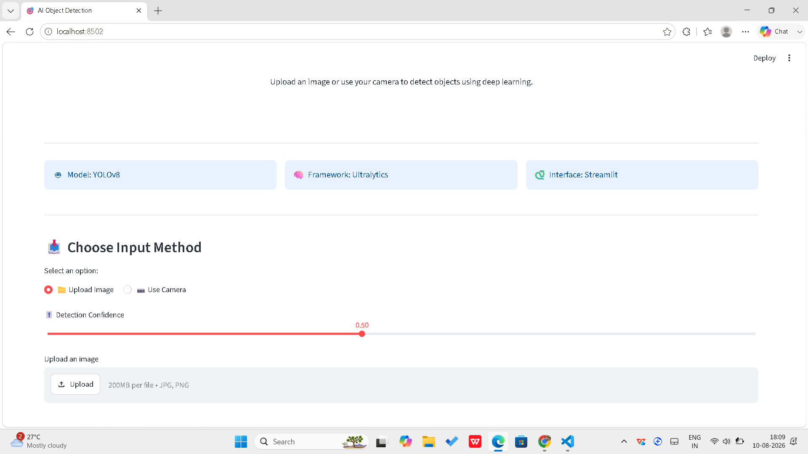
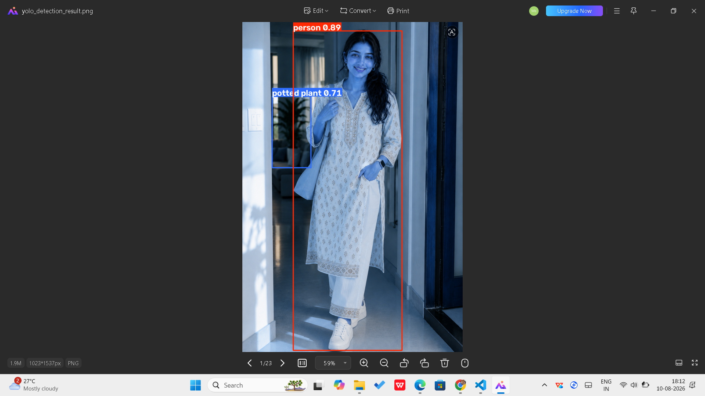
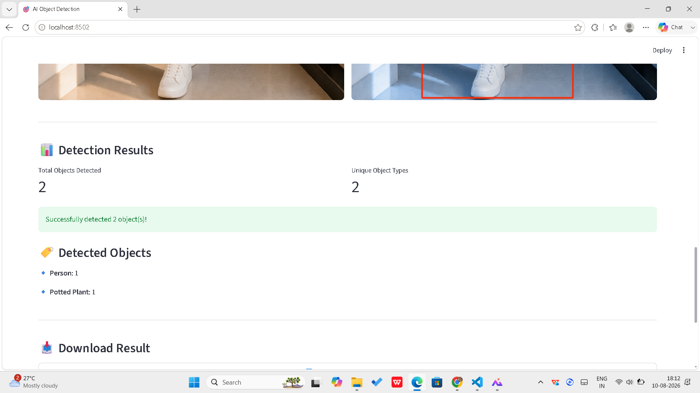

# 🎯 AI Object Detection using YOLOv8

An AI-powered object detection web application built using **YOLOv8, Ultralytics, Python, OpenCV, Pillow, and Streamlit**.

The application allows users to upload an image or capture an image using their camera and automatically detects objects using a pretrained YOLOv8 deep learning model.

---

## 🚀 Project Overview

Object detection is a computer vision task that identifies objects present in an image and determines their locations using bounding boxes.

This project uses the **YOLOv8 (You Only Look Once)** model to perform fast and efficient object detection.

The application provides an interactive Streamlit web interface where users can:

- 📷 Upload an image
- 📹 Capture an image using the camera
- 🎯 Detect multiple objects
- 📊 View detection confidence scores
- 🔢 View the number of detected objects
- 🖼️ View detected objects with bounding boxes
- 📥 Download the processed detection result
- 🎚️ Adjust the detection confidence threshold

---

## ✨ Features

### 📤 Image Upload

Users can upload images in:

- JPG
- JPEG
- PNG

The uploaded image is processed by the YOLOv8 model for object detection.

### 📹 Camera Input

Users can capture an image directly using their device camera and run object detection on the captured image.

### 🎯 YOLOv8 Object Detection

The application uses the pretrained **YOLOv8 Nano (YOLOv8n)** model to detect objects and draw bounding boxes around them.

Each detected object includes:

- Object class
- Bounding box
- Confidence score

### 📊 Detection Summary

🎚️ Confidence Control

Users can adjust the detection confidence threshold using an interactive slider.

A higher confidence threshold displays only more confident detections, while a lower threshold allows more possible detections.

📥 Download Detection Result

Users can download the processed image containing the YOLOv8 detection bounding boxes.

🧠 How It Works
User Input
     ↓
Upload Image / Capture Camera Image
     ↓
Image Processing
     ↓
YOLOv8 Model
     ↓
Object Detection
     ↓
Bounding Boxes + Confidence Scores
     ↓
Detection Summary
     ↓
Display Result
     ↓
Download Detection Image

🛠️ Technologies Used
Technology	Purpose
🐍 Python	Programming language
🎯 YOLOv8	Object detection model
🧠 Ultralytics	YOLO framework and model inference
🌐 Streamlit	Interactive web application interface
👁️ OpenCV	Computer vision and image processing
🖼️ Pillow	Image loading and processing
🔢 NumPy	Numerical and image array operations
🔧 Git & GitHub	Version control and project hosting

📁 Project Structure
Object_Detection_YOLO/
│
├── app.py                  # Main Streamlit application
├── README.md               # Project documentation
├── requirements.txt        # Python dependencies
├── yolov8n.pt              # Pretrained YOLOv8 model
├── .gitignore              # Git ignored files
│
├── images/                 # Project images
├── models/                 # Model-related files
├── outputs/                # Detection outputs
└── screenshots/            # Application screenshots

⚙️ Installation
1. Clone the Repository
git clone https://github.com/Reena-1-1/Object_Detection_YOLO.git
2. Navigate to the Project Directory
cd Object_Detection_YOLO
3. Create a Virtual Environment
python -m venv .venv
4. Activate the Virtual Environment
Windows PowerShell
.\.venv\Scripts\Activate.ps1
5. Install Dependencies
pip install -r requirements.txt

▶️ Run the Application

Start the Streamlit application using:

streamlit run app.py

The application will open in your default web browser.

You can then:

Upload an image or capture an image using the camera.
Adjust the detection confidence.
Run YOLOv8 object detection.
View the detected objects and bounding boxes.
Download the detection result.

📊 Example Detection
The application can detect objects from the pretrained YOLOv8 model, including:

👤 Person
🪴 Potted Plant
🐕 Dog
🚗 Car
🪑 Chair
📱 Cell Phone
🎒 Backpack
🐈 Cat
🚌 Bus
🚲 Bicycle

The detected objects are displayed with:

Bounding boxes
Object names
Confidence scores
Detection counts

## 🖼️ Application Screenshots

### 🏠 Application Interface


### 🎯 Object Detection Result


### 📊 Detection Summary


---

## 🔗 Project Links
### 💻 GitHub Repository
[View the GitHub Repository](https://github.com/Reena-1-1/Object_Detection_YOLO)


🌐 Live Demo

Add your deployed Streamlit application link here after deployment.

🔮 Future Improvements

The following improvements can be added in future versions:

🎥 Real-time video object detection
📹 Improved webcam detection
📈 Detection analytics dashboard
🧠 Custom YOLO model training
☁️ Cloud deployment
📱 Mobile-friendly interface
⚡ GPU acceleration
📊 Detection history and statistics
🎯 Custom object classes
🔔 Object detection alerts
💡 Learning Outcomes

Through this project, I gained practical experience in:

Computer Vision
Deep Learning
Object Detection
YOLOv8
Python
Ultralytics
Streamlit
OpenCV
Image Processing
Model Integration
Building AI-powered web applications
Git & GitHub

🎯 Project Highlights

This project demonstrates the practical implementation of an AI-powered computer vision application using a pretrained deep learning model.

Key Highlights
✅ Integrated YOLOv8 for object detection
✅ Built an interactive Streamlit interface
✅ Implemented image upload functionality
✅ Implemented camera input
✅ Added configurable confidence threshold
✅ Displayed bounding boxes and confidence scores
✅ Added object detection summary
✅ Added object counting
✅ Added detection result download
✅ Organized the project using Git and GitHub

👩‍💻 Author

Reena Jesupa

BCA – Artificial Intelligence & Machine Learning

⭐ Skills Demonstrated
Python
Computer Vision
Deep Learning
YOLOv8
Ultralytics
OpenCV
Streamlit
Image Processing
AI Application Development
Machine Learning
Git
GitHub

The application displays the detected object names along with their counts.

Example:

```text
Person: 1
Potted Plant: 1
